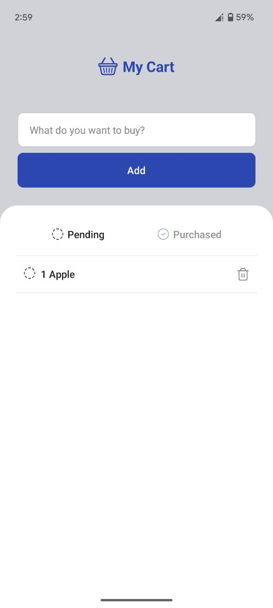
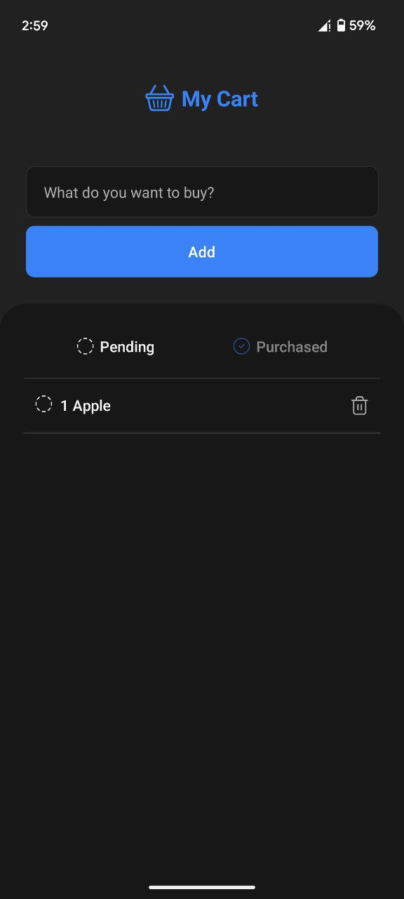
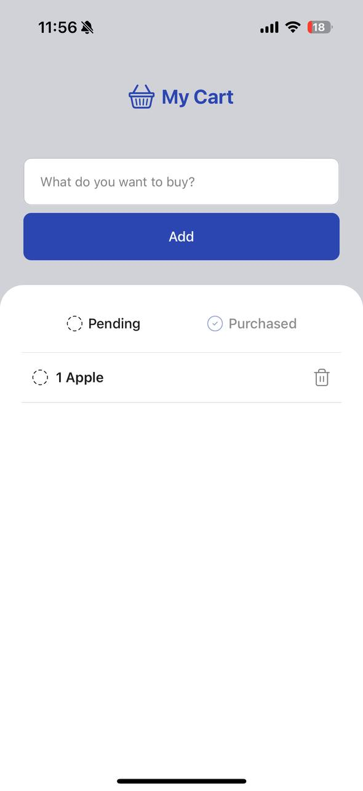
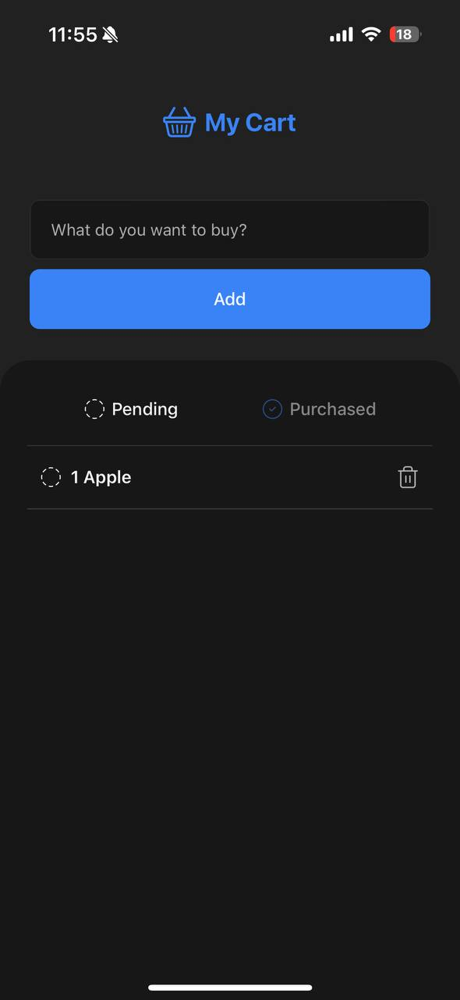

# 🛒 My Cart

**My Cart** is a lightweight and responsive cross-platform shopping cart demo application

## 📸 Screenshots

<p align="center">
  
  &nbsp;&nbsp;
  
  &nbsp;&nbsp;
  
  &nbsp;&nbsp;
  
</p>


## ✨ Features

- **Dynamic Theme Switching**  
  Automatically adapts to the system's light or dark mode

- **Auto Language Detection**  
  Detects the device language and applies the appropriate localization without manual configuration.

- **Responsive Layout**  
  UI components adjust fluidly across different screen sizes and device types (phones, tablets).

- **Platform-Aware App Icon**  
  - **Android**: Supports [Monet](https://m3.material.io/styles/color/dynamic-color/overview) dynamic icons for Material You integration.  
  - **iOS**: Icon adapts to system appearance with tint support (dark/light mode aware).

- **Android Build Optimization**  
  - Minified resources and disabled unnecessary features to reduce final build size.  
  - Improved asset compression and build configurations inside the `/android` folder.

## 🧱 Tech Stack

- **React Native** + **Expo** — core framework for cross-platform development  
- **Zustand** + **@react-native-async-storage/async-storage** — global state management with persistent storage  
- **i18next** + **expo-localization** — multilanguage support and automatic locale detection  
- **react-native-size-matters** — scalable and adaptive UI based on device dimensions  
- **react-compiler** — automatic memoization and performance optimizations (experimental)
- **expo-splash-screen** — for automatically adapting the splash screen to system theme

## 🚀 Getting Started

```bash
git clone https://github.com/ruamess/my-cart-app.git
cd my-cart-app
npm install
npx expo start
